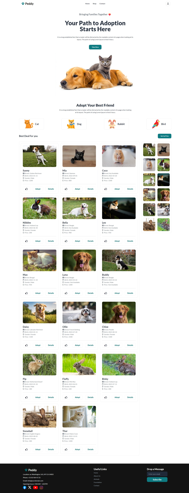

## Batch 10 Assignment 6 - Pet Adoption Platform

- Title: Peddy - Pet Adoption Platform

- Short description of the project

  - This project is Pet Adoption Platform any one can adopt a pet. you can buy a pet and see all pets name, images and more. you can sort pet by price. you can see category by clicked pet's icon.

- 5 key features of the project:

  - User can see all details of pets. like name, breed, gender, price, vaccinated status, pet details.
  - User can buy a any pet from here. you can see all pets name, images and more.
  - User can use this website any devise's you can see all pets name, images and more.
  - User can sort pet by price. you can see all pets name, images and more.
  - User can see category by clicked pet's icon. you can see all pets name, images and more.

- ES6 features used:

  - Fetch for To fetching data from API.
  - Async & Await for promise resolve to get data.
  - Nullish coalescing operator for Null or Undefined.Values.
  - Fat Arrow => function for using function to easy way.
  - Reusable function for using function to easy way.
  - Template literals for using html to easy way.

## Project Link

- Live link to the deployed project:

  - https://batch10-assignment-6.netlify.app
  - https://batch10-assignment-6.surge.sh

## Make Resources

- [Tailwind CSS](https://tailwindcss.com/)
- [Daisy UI](https://daisyui.com/)
